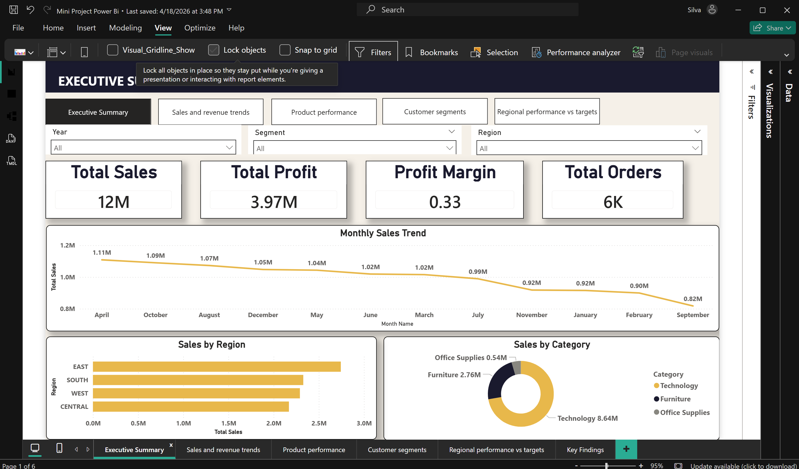
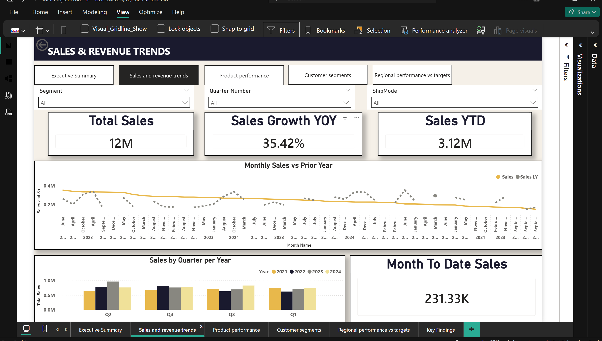
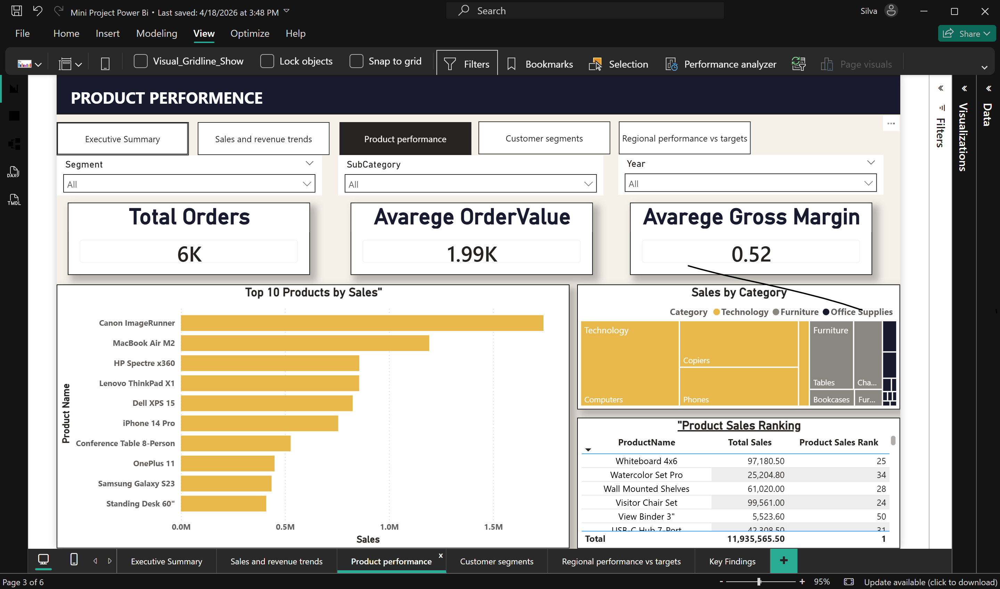
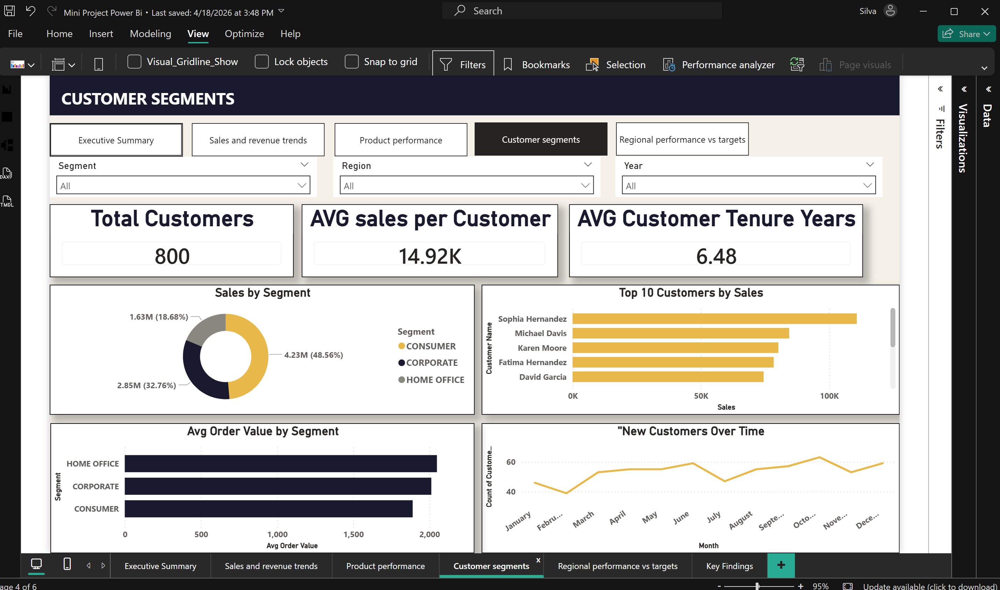
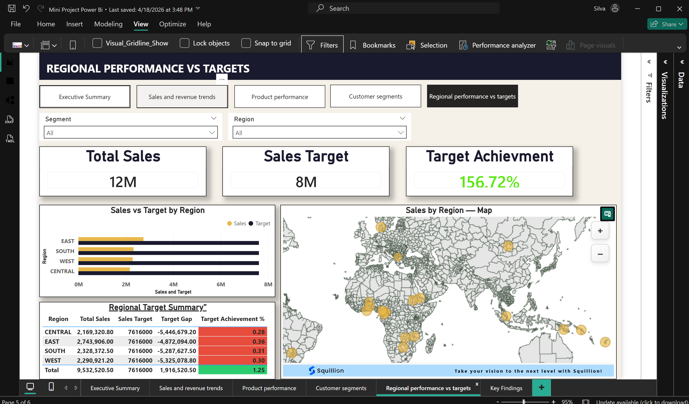

# 🌍 Global Superstore Analytics — Power BI Dashboard

## 📌 Project Overview
An interactive 5-page Power BI dashboard built to analyze global sales, 
profit, customer segments, and shipping performance across multiple countries.

---

## 🎯 Objective
To transform raw transactional data into actionable business insights 
using data modeling, DAX calculations, and interactive visualizations.

---

## 🛠️ Tools & Technologies
- **Power BI Desktop** — Dashboard development
- **Power Query (M Language)** — Data cleaning & transformation
- **DAX** — KPI measures and time intelligence
- **Star Schema Modeling** — Fact & dimension table structure

---

## 📊 Dashboard Pages

| Page | Title | Description |
|------|-------|-------------|
| 1 | Executive Summary | High-level KPIs — Total Sales, Profit, Orders, Customers |
| 2 | Sales Analysis | Sales trends by region, category & segment |
| 3 | Product Performance | Top/bottom products by profit margin |
| 4 | Customer Insights | Customer segmentation and behaviour |
| 5 | Shipping Analysis | Delivery performance by ship mode |

---

## 🖼️ Dashboard Screenshots

### Page 1 — Executive Summary


### Page 2 — Sales Analysis


### Page 3 — Product Performance


### Page 4 — Customer Insights


### Page 5 — Shipping Analysis


---

## 🧮 Key DAX Measures

### KPI Measures
```dax
Total Sales = SUM(FactOrders[Sales])

Total Profit = SUM(FactOrders[Profit])

Total Orders = DISTINCTCOUNT(FactOrders[Order ID])

Profit Margin % = DIVIDE([Total Profit], [Total Sales], 0)
```

### Time Intelligence Measures
```dax
Sales PY = 
CALCULATE([Total Sales], SAMEPERIODLASTYEAR(DimDate[Date]))

YoY Sales Growth % = 
DIVIDE([Total Sales] - [Sales PY], [Sales PY], 0)

YTD Sales = 
TOTALYTD([Total Sales], DimDate[Date])
```

---

## 🗂️ Data Model
- **Star Schema** with 1 Fact Table and 4 Dimension Tables
- **FactOrders** — transactional sales data
- **DimCustomer** — customer details
- **DimProduct** — product hierarchy
- **DimLocation** — regional geography
- **DimDate** — custom DAX date table

---

## 🔍 Key Findings
- Example: **Technology** is the highest revenue category
- Example: **APAC region** shows the strongest YoY growth
- Example: **Consumer segment** accounts for over 50% of total orders

---

## 📁 Repository Structure
📦 global-superstore-analytics
┣ 📊 GlobalSuperstore.pbix
┣ 📄 GlobalSuperstore.csv
┣ 📝 Report.pdf
┣ 📂 screenshots/
┃ ┣ 🖼️ page1-executive-summary.png
┃ ┣ 🖼️ page2-sales-analysis.png
┃ ┣ 🖼️ page3-product-performance.png
┃ ┣ 🖼️ page4-customer-insights.png
┃ ┗ 🖼️ page5-shipping-analysis.png
┗ 📖 README.md

---

## 👩‍💻 Author
**Kaveesha Sanhinda Silva** | BA Undergraduate   
🔗 [LinkedIn Profile](www.linkedin.com/in/kaveesha-sanhinda-662910373)  
📧kaveeshasanhinda2003@gmail.com
